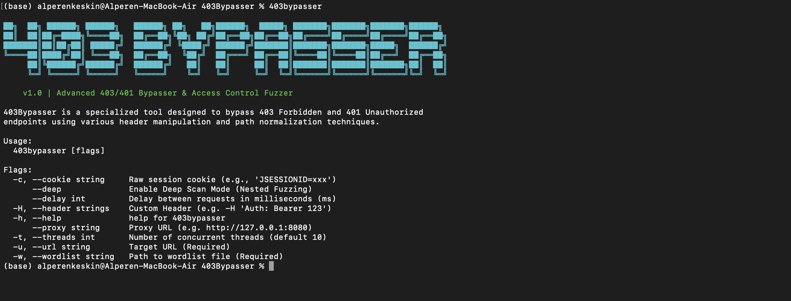

<h1 align="center">403 Bypasser</h1>

<p align="center">
  
  
  
</p>

<p align="center">
  <b>🎯 Advanced 403/401 Bypasser & Access Control Fuzzer</b>
</p>



<p align="center">
  A specialized command-line tool dedicated to bypassing <code>403 Forbidden</code> and <code>401 Unauthorized</code> endpoints. Built on the <b>Cobra Framework</b>, it uses advanced header manipulation and path normalization techniques to test and evade Access Control Lists (ACLs).
</p>

---

## ✨ Key Features

- 🎯 **Success-Oriented:** Automatically filters noise and displays only `200 OK` successful bypasses.
- 🧠 **Smart Wordlist Detection:** If no wordlist is specified via `-w`, the tool automatically uses `"wordlists/common.txt"`.
- 🎨 **Dual Calibration:** Automatically measures 404 and Root page sizes to **eliminate False Positives**.
- 🕵️ **Deep Scan Mode:** Performs exhaustive nested fuzzing for high-security environments.
- 📝 **Auto Logging:** All successful hits are instantly saved to `results.txt`.

---

## 📦 Installation

### Option 1: Go Install (Recommended)

Simplest way to install. Since the project uses a flat layout, you can install it directly:

```bash
go install -v github.com/alperenkesk/403Bypasser@latest
```
> Requires Go 1.21+. Ensure `$(go env GOPATH)/bin` is in your `$PATH`.

### Option 2: Build from Source (Makefile)

This method installs the tool globally so you can run it from anywhere.

```bash
git clone "https://github.com/alperenkesk/403Bypasser.git"
cd 403Bypasser
make install
```

---

## 🚀 Usage

Since the tool is installed globally, you can run it directly without `./` prefix:

```bash
# Basic scan (Automatically uses wordlists/common.txt)
403bypasser -u "https://target.com"

# Custom wordlist scan
403bypasser -u "https://target.com" -w "my_wordlist.txt"

# Deep scan (Comprehensive Mode)
403bypasser -u "https://target.com" --deep
```

### Command Line Arguments

| Flag | Short | Description | Default |
|------|-------|-------------|---------|
| `--url` | `-u` | Target URL (e.g., `https://example.com`) | **Required** |
| `--wordlist` | `-w` | Path to the directory wordlist file | `"wordlists/common.txt"` |
| `--cookie` | `-c` | Raw session cookies (e.g., `JSESSIONID=xxx`) | `""` |
| `--header` | `-H` | Custom Header (Can be used multiple times) | `""` |
| `--proxy` | - | Proxy URL (e.g., `http://127.0.0.1:8080`) | `""` |
| `--delay` | - | Delay between requests in milliseconds (ms) | `0` |
| `--threads` | `-t` | Number of concurrent threads | `10` |
| `--deep` | - | Enable Deep Scan (Nested Header & Path Fuzzing) | `False` |
| `--help` | `-h` | Show help menu | - |

---

## 🛠 Examples

**1. Proxy Support (Burp Suite / Caido)**
Route all traffic through a proxy to analyze requests or bypass IP restrictions.
```bash
403bypasser -u "https://target.com" --proxy "http://127.0.0.1:8080"
```

**2. Custom Headers & Authorization**
Add custom headers like Bearer tokens or specific User-Agents.
```bash
403bypasser -u "https://api.target.com" -H "Authorization: Bearer XYZ123" -H "X-Client-ID: 99"
```

**3. WAF/Rate Limit Evasion**
Add a delay (e.g., 500ms) between requests to avoid getting banned.
```bash
403bypasser -u "https://target.com" -t 5 --delay 500
```

**4. Deep Scan (Comprehensive Mode)**
Exhaustively tests every header and path combination. Slower but higher success rate.
```bash
403bypasser -u "https://target.com" --deep
```

---

## 🤝 Contributing

Contributions are welcome!

1. Fork the repository.
2. Create a feature branch (`git checkout -b feature/NewPayloads`).
3. Commit your changes.
4. Push to the branch.
5. Open a Pull Request.

---

## ⚠️ Disclaimer

This tool is developed for **educational purposes** and **authorized security testing** only. The author is not responsible for any misuse or damage caused by this tool. Always obtain proper authorization before testing any system.

---

<p align="center">
  Crafted with 🛡️ for Security Researchers by <a href="https://github.com/alperenkesk">alperenkesk</a>
</p>
